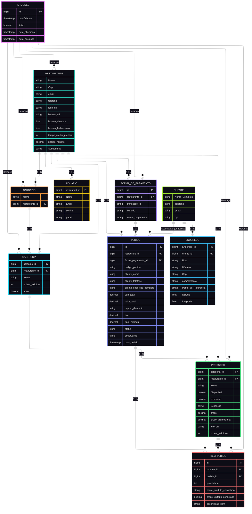

# Modelagem do Banco de Dados - ChegaAI

Representação do modelo de dados utilizado no projeto ChegaAI, incluindo as entidades, atributos e relacionamentos entre elas.

```mermaid
---
config:
  theme: redux-dark-color
  look: neo
  layout: elk
---
erDiagram
    ID_MODEL ||--o{ RESTAURANTE : "Herança"
    ID_MODEL ||--o{ CARDAPIO : "Herança"
    ID_MODEL ||--o{ CATEGORIA : "Herança"
    ID_MODEL ||--o{ PRODUTOS : "Herança"
    ID_MODEL ||--o{ FORMA_DE_PAGAMENTO : "Herança"
    ID_MODEL ||--o{ ITEM_PEDIDO : "Herança"

    RESTAURANTE ||--o{ USUARIO : "1 : N"
    RESTAURANTE ||--o{ CARDAPIO : "1 : N"
    RESTAURANTE ||--o{ CATEGORIA : "1 : N"
    RESTAURANTE ||--o{ PRODUTOS : "1 : N"
    RESTAURANTE ||--o{ FORMA_DE_PAGAMENTO : "1 : N"
    RESTAURANTE ||--o{ PEDIDO : "1 : N"

    CARDAPIO ||--o{ CATEGORIA : "1 : N"
    CATEGORIA ||--o{ PRODUTOS : "1 : N"
    PRODUTOS ||--o{ ITEM_PEDIDO : "1 : N"

    CLIENTE ||--o{ ENDERECO : "1 : N"
    CLIENTE ||--o{ PEDIDO : "Associação (snapshot)"

    FORMA_DE_PAGAMENTO ||--o{ PEDIDO : "1 : N"
    PEDIDO ||--o{ ITEM_PEDIDO : "1 : N"

    ID_MODEL {
        bigint id PK
        timestamp dataCriacao
        boolean Ativo
        timestamp data_alteracao
        timestamp data_exclusao
    }

    RESTAURANTE {
        string Nome
        string Cnpj
        string email
        string telefone
        string logo_url
        string banner_url
        time horario_abertura
        time horario_fechamento
        int tempo_medio_preparo
        decimal pedido_minimo
        string Subdominio
    }

    USUARIO {
        bigint restaurant_id FK
        string Nome
        string Email
        string senha
        string papel
    }

    CARDAPIO {
        string Nome
        bigint restaurante_id FK
    }

    CATEGORIA {
        bigint cardapio_id FK
        bigint restaurante_id FK
        string Nome
        int ordem_exibicao
        boolean ativo
    }

    PRODUTOS {
        bigint categoria_id FK
        bigint restaurante_id FK
        string Nome
        boolean Disponivel
        boolean promocao
        string Descricao
        decimal preco
        decimal preco_promocional
        string foto_url
        int ordem_exibicao
    }

    CLIENTE {
        string Nome_Completo
        string Telefone
        string email
        string cpf
    }

    ENDERECO {
        bigint Endereco_id PK
        bigint cliente_id FK
        string Rua
        string Número
        string Cep
        string complemento
        string Ponto_de_Referencia
        float latitude
        float longitude
    }

    FORMA_DE_PAGAMENTO {
        bigint id PK
        bigint restaurante_id FK
        string transacao_id
        string Metodo
        string status_pagamento
    }

    PEDIDO {
        bigint id PK
        bigint restaurant_id FK
        bigint forma_pagamento_id FK
        string codigo_pedido
        string cliente_nome
        string cliente_telefone
        string cliente_endereco_completo
        decimal sub_total
        decimal valor_total
        string cupom_desconto
        decimal troco
        decimal taxa_entrega
        string status
        string observacao
        timestamp data_pedido
    }

    ITEM_PEDIDO {
        bigint id PK
        bigint produto_id FK
        bigint pedido_id FK
        int quantidade
        string nome_produto_congelado
        decimal preco_unitario_congelado
        string observacao_item
    }
```